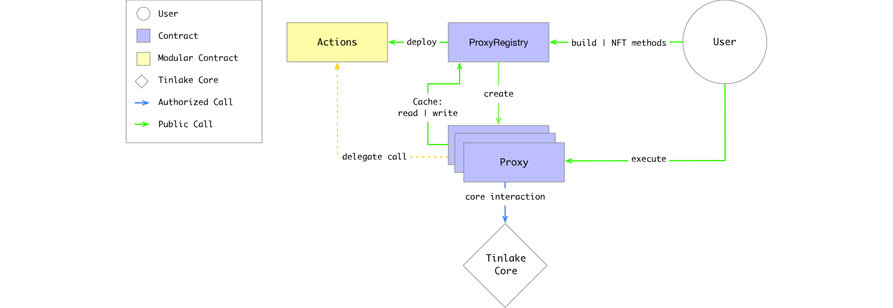

# tinlake-proxy
**This code is mostly copied from [ds-proxy](https://github.com/dapphub/ds-proxy). It has only been extended to allow for authentication with an NFT ownership check**

## Proxy Registry
To interact with Tinlake through a proxy, the user first needs to deploy a proxy by calling the ProxyRegistry.build() method. This method mints an NFT that into the sender's wallet that is then used to verify access to the contract.

The `ProxyRegistry` implements an ERC721 NFT interface. To transfer ownership over a proxy contract you can use a standard NFT token transfer (`transferFrom(from, to, tokenId)`).

### `isProxy(address addr) public returns (bool)`
Returns true, if the provided address is a proxy that was created by the registry contract.

### `proxies(uint id) public returns (address)`
Returns the proxy contract address for a given `id`. The `id` is the id of the token used to track ownership over the proxy.

### `ownerOf(uint id) public returns (address)` (ERC721 method)
Returns the owner of a proxy and the corresponding NFT.

The contract also implements all other ERC721 standard methods as defined in [...] TODO: link

## Proxy
The proxy contract allows execution of arbitray code using the `execute(bytes memory _code, bytes memory _data)` method. This method deploys a contract with the provided code, if it is not already cached and executes it with delegate call.

Deployed contracts are cached in the proxy registry by hashing the bytecode and storing a mapping of hashes to address in the registry under `Registry.cache(bytes32 hash) returns (address)`.

Alternatively, you can call the method `execute(address _target, bytes memory _data)` directly with an address of an already deployed contract.

